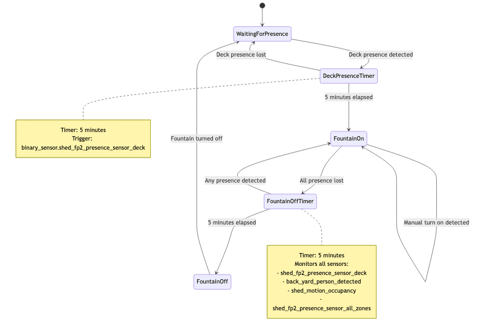

# Backyard Fountain Presence Automation

A Digital Alchemy automation service that intelligently controls a backyard fountain based on presence detection with configurable delays and multi-sensor monitoring.

## Overview

This automation provides smart fountain control with the following key features:

- **Turn-on Logic**: Fountain activates after 5 minutes of continuous deck presence
- **Turn-off Logic**: Fountain deactivates after 5 minutes when all monitored areas show no presence
- **Manual Override Support**: Handles manual fountain control while maintaining automatic monitoring
- **Multi-sensor Monitoring**: Monitors multiple presence sensors for comprehensive coverage

## State Diagram

The automation follows a state-based approach with dual timers:



## Configuration

### Monitored Entities

#### Fountain Control
- **Entity**: `switch.front_garden_fountain`
- **Type**: Boolean switch for fountain pump control

#### Presence Sensors

**Primary Trigger (Turn-on)**:
- `binary_sensor.shed_fp2_presence_sensor_deck` - Deck presence sensor

**All Monitored Sensors (Turn-off)**:
- `binary_sensor.shed_fp2_presence_sensor_deck` - Deck presence
- `binary_sensor.back_yard_person_detected` - General backyard person detection
- `binary_sensor.shed_motion_occupancy` - Shed motion sensor
- `binary_sensor.shed_fp2_presence_sensor_all_zones` - All FP2 zones

### Timing Configuration

```typescript
const PRESENCE_ON_DELAY_MS = 5 * 60 * 1000; // 5 minutes
const PRESENCE_OFF_DELAY_MS = 5 * 60 * 1000; // 5 minutes
```

## Behavior

### Turn-On Sequence
1. **Deck presence detected** → Start 5-minute timer
2. **Timer expires** → Turn fountain on
3. **Presence lost before timer** → Cancel timer

### Turn-Off Sequence
1. **All presence sensors show no activity** → Start 5-minute timer
2. **Timer expires** → Turn fountain off
3. **Any presence detected** → Cancel timer

### Manual Override Handling
- **Manual turn-on**: Clears any pending turn-on timer, begins monitoring for auto turn-off
- **Manual turn-off**: Clears all timers, stops monitoring until next presence trigger

## Installation

Add to your Digital Alchemy application services:

```typescript
// main.ts
import { BackyardFountainPresenceAutomation } from "./services/backyard_fountain_presence/service";

export const MY_APPLICATION = CreateApplication({
  name: "da_automation",
  libraries: [LIB_HASS, LIB_SYNAPSE, LIB_AUTOMATION],
  services: {
    backyardFountainPresence: BackyardFountainPresenceAutomation.create,
    // ... other services
  },
});
```

## Architecture

### Entity Wrapper Pattern

The automation uses entity wrappers for testability and abstraction:

```typescript
export class BackyardFountainPresenceAutomation {
    constructor(
        private readonly logger: TServiceParams['logger'],
        private readonly fountainEntity: BooleanEntityWrapper,
        private readonly deckPresenceEntity: BinarySensorEntityWrapper,
        private readonly allPresenceEntities: BinarySensorEntityWrapper[],
    ) {
        this.setupAutomation();
    }
}
```

### Key Methods

- `handleDeckPresenceChange()`: Manages turn-on logic for deck presence
- `handleAnyPresenceChange()`: Manages turn-off logic for all presence sensors
- `handleFountainStateChange()`: Handles manual overrides and state changes
- `startFountainOnTimer()` / `startFountainOffTimer()`: Timer management
- `isAnyPresenceDetected()`: Multi-sensor presence detection

## Testing

Comprehensive test coverage with 15 test cases covering:

- ✅ Turn-on timer logic with deck presence
- ✅ Turn-off timer logic with multi-sensor monitoring
- ✅ Manual override scenarios
- ✅ Edge cases and error handling
- ✅ Timer cancellation and restart logic
- ✅ Rapid state change handling

### Running Tests

```bash
npm test -- src/services/backyard_fountain_presence/tests/
```

### Test Structure

```
tests/
├── backyard_fountain_presence.test.ts
```

Tests use the dual testing approach:
- **Business Logic Tests**: Mock entity wrappers with vitest
- **Timer Testing**: Fake timers with `vi.useFakeTimers()`

## Logging

The automation provides detailed logging for debugging:

```typescript
this.logger.info('Starting fountain on timer (5 minutes)');
this.logger.info('Turning fountain on due to presence');
this.logger.info('Starting fountain off timer (5 minutes)');
this.logger.info('Turning fountain off due to no presence');
```

## Error Handling

- **Undefined States**: Gracefully handles offline/unavailable sensors
- **Timer Conflicts**: Proper cleanup prevents multiple concurrent timers
- **State Consistency**: Validates fountain state before timer operations

## Dependencies

- `@digital-alchemy/core` - Core framework
- `@digital-alchemy/hass` - Home Assistant integration
- Entity wrappers from `../../entities/`

## Development

### Adding New Presence Sensors

1. Add entity ID to `allPresenceEntities` array in `create()` method
2. Update tests to include new sensor mock
3. Update documentation

### Modifying Delays

Update the constants at the top of the service file:

```typescript
const PRESENCE_ON_DELAY_MS = 3 * 60 * 1000; // 3 minutes
const PRESENCE_OFF_DELAY_MS = 10 * 60 * 1000; // 10 minutes
```

## Troubleshooting

### Common Issues

1. **Fountain not turning on**: Check deck presence sensor state and logs
2. **Fountain not turning off**: Verify all presence sensors are reporting correctly
3. **Timer conflicts**: Check logs for timer start/stop messages

### Debug Steps

1. Enable debug logging in Digital Alchemy
2. Monitor entity states in Home Assistant
3. Check automation logs for timer events
4. Verify sensor connectivity and availability

## License

Part of the Digital Alchemy Home Automation system.
